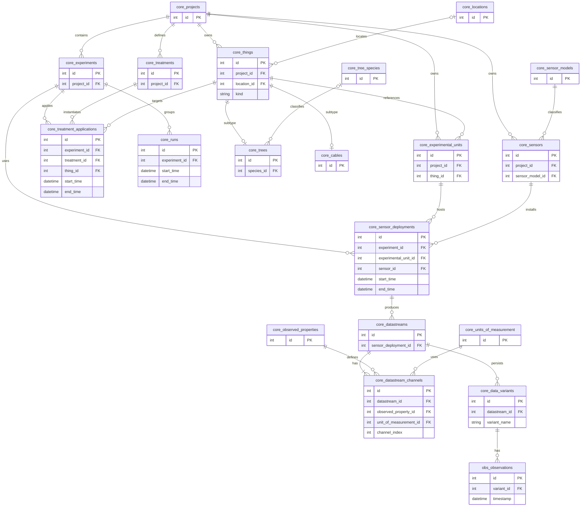

# Domain Model Diagram (Mermaid)

## Purpose
This document provides a checkable Mermaid ER diagram of the ArboLab data model.
It is intended to review entity relationships, cardinalities (one vs many), and
core relationships and cardinalities.

## Notes
- The diagram uses table-level names (snake_case) with the `core_` prefix for
  canonical workspace tables.
- `obs_observations` is an external/view-like entity backed by Parquet (no
  canonical relational table).
- Some attribute lists are intentionally minimal and focus on keys and
  join-critical fields.

## Canonical Core Model (ArboLab)

