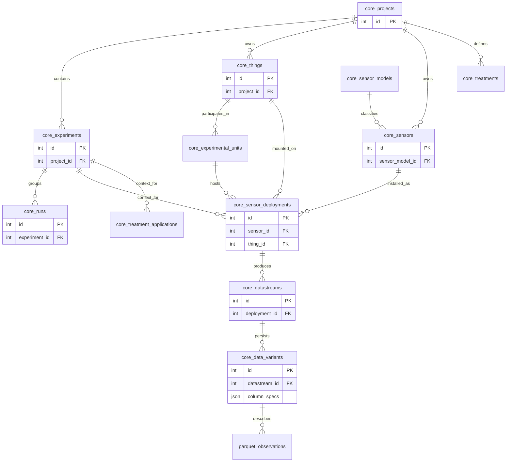

# Data Model & Persistence Specification

**Binding Rules**: See `../../AGENTS.md`.
**Terminology**: Strictly follows `../requirements/glossary.md`.

This document defines the canonical persistence schema for ArboLab.
It governs the DuckDB workspace database structure, the Parquet storage layout,
and the column metadata contracts.

## 1. Entity Relationship Diagram

The following diagram defines the core normative relationships.
Table names are prefixed with `core_` to distinguish them from plugin-specific extensions.



## 2. Relational Schema (DuckDB)

All tables reside in the main workspace database file (default: `arbolab.duckdb`).
Timestamps are stored as `TIMESTAMP` (UTC). JSON fields are stored as JSON type.

### 2.1 Physical Perspective (Assets)

| Table | Column | Type | Constraints | Description |
|:---|:---|:---|:---|:---|
| `core_things` | `id` | INTEGER | PK | Stable identity of a real-world object. |
| | `project_id` | INTEGER | FK | Owner project. |
| | `kind` | VARCHAR | | Discriminator (e.g., 'tree', 'cable'). |
| | `properties` | JSON | | Extensible attributes (species, dimensions). |
| `core_sensor_models` | `id` | INTEGER | PK | |
| | `model_name` | VARCHAR | UNIQUE | Manufacturer model name. |
| | `capabilities` | JSON | | Nominal units, channel names. |
| `core_sensors` | `id` | INTEGER | PK | |
| | `project_id` | INTEGER | FK | Owner project. |
| | `sensor_model_id` | INTEGER | FK | Reference to capabilities. |
| | `serial_number` | VARCHAR | | Device specific ID. |

### 2.2 Experimental Perspective (Campaigns)

| Table | Column | Type | Constraints | Description |
|:---|:---|:---|:---|:---|
| `core_projects` | `id` | INTEGER | PK | |
| | `name` | VARCHAR | UNIQUE | |
| `core_experiments` | `id` | INTEGER | PK | |
| | `project_id` | INTEGER | FK | |
| | `time_range` | INTERVAL | | Optional structural bounds. |
| `core_runs` | `id` | INTEGER | PK | |
| | `experiment_id` | INTEGER | FK | |
| | `name` | VARCHAR | | e.g., "Run 01 - Pull Test". |
| | `start_time` | TIMESTAMP | | Execution start. |
| | `end_time` | TIMESTAMP | | Execution end. |
| `core_sensor_deployments` | `id` | INTEGER | PK | Central Context Entity. |
| | `experiment_id` | INTEGER | FK | Context scope. |
| | `sensor_id` | INTEGER | FK | The device used. |
| | `thing_id` | INTEGER | FK | The object measured. |
| | `start_time` | TIMESTAMP | | Installation time. |
| | `end_time` | TIMESTAMP | | Removal time (NULL = active). |
| | `mounting` | JSON | | Height, orientation, offset. |

### 2.3 Analytical Perspective (Logic)

| Table | Column | Type | Constraints | Description |
|:---|:---|:---|:---|:---|
| `core_treatments` | `id` | INTEGER | PK | Abstract condition definition. |
| | `project_id` | INTEGER | FK | |
| | `definition` | JSON | | Factors and levels. |
| `core_treatment_applications` | `id` | INTEGER | PK | Concrete application event. |
| | `treatment_id` | INTEGER | FK | |
| | `thing_id` | INTEGER | FK | |
| | `start_time` | TIMESTAMP | | |
| `core_experimental_units` | `id` | INTEGER | PK | Statistical subject. |
| | `definition` | JSON | | References to Things included. |

### 2.4 Data Perspective (Storage)

| Table | Column | Type | Constraints | Description |
|:---|:---|:---|:---|:---|
| `core_datastreams` | `id` | INTEGER | PK | Logical container. |
| | `deployment_id` | INTEGER | FK | 1:1 Origin. |
| `core_data_variants` | `id` | INTEGER | PK | Physical Dataset Metadata. |
| | `datastream_id` | INTEGER | FK | |
| | `variant_name` | VARCHAR | | e.g., 'raw', 'resampled'. |
| | `format` | VARCHAR | | 'parquet'. |
| | `relative_path` | VARCHAR | | Path inside `workspace_root`. |
| | `column_specs` | JSON | | Normative: See Section 3. |

## 3. Column Metadata Contract (ColumnSpec)

The `column_specs` JSON field in `core_data_variants` must describe every column
in the persisted dataset. This schema ensures that plots and tables can be
generated without hardcoding.

### 3.1 JSON Schema (Per Column)

```json
{
  "name": "inclination_x",      // (Required) Workspace column name
  "dtype": "float64",           // (Required) Logical type
  "unit": "deg",                // (Required) UCUM identifier (or '1' for dimensionless)
  "description": "...",         // (Required) Human readable context

  // Display Metadata (Optional but Recommended)
  "label": "Inclination X",     // Short display label
  "symbol": "phi",              // Math symbol (no $ delimiters)
  "symbol_latex": "\\phi",      // Specific LaTeX override
  "unit_symbol": "°",           // Display symbol
  "unit_siunitx": "\\degree"    // LaTeX siunitx string
}
```

### 3.2 Unit Propagation Rules

- **Raw Ingestion**: Plugins must map raw device units to valid `ColumnSpec` entries.
- **Derivation**: Derived datasets must update unit and label. Dimensionless columns use `unit: "1"`.
- **Export**:
    - Plots use `label` + `unit_symbol` (e.g., "Inclination X [°]").
    - LaTeX uses `symbol_latex` + `unit_siunitx`.

## 4. Observation Storage (Parquet)

Observations are not stored in DuckDB tables. They are stored as Parquet files
referenced by `core_data_variants.relative_path`.

### 4.1 Schema Expectation

The Parquet file schema typically follows the Wide Layout:

- `timestamp` (Timestamp, UTC, Sorted)
- `col_1` (Sensor Value)
- `col_2` (Sensor Value)
- ...

### 4.2 Querying

DuckDB accesses data via the `read_parquet()` function, constructing logical
views by joining `core_data_variants` with the file content.

```sql
-- Conceptual View Construction
CREATE VIEW v_raw_inclination AS
SELECT 
    m.deployment_id,
    p.timestamp,
    p.inclination_x
FROM core_data_variants v
JOIN read_parquet(v.relative_path) p ON true
JOIN core_datastreams d ON v.datastream_id = d.id
JOIN core_sensor_deployments m ON d.deployment_id = m.id
WHERE v.variant_name = 'raw';
```