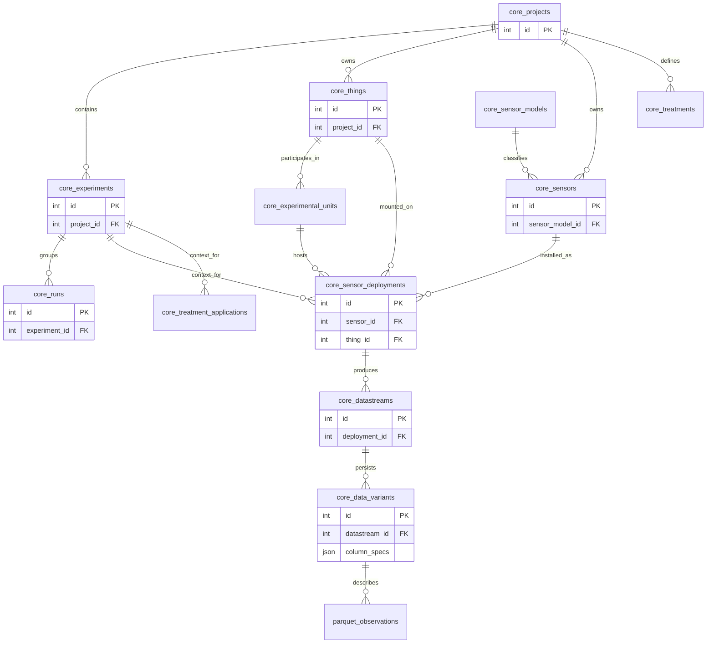

# Data Model & Persistence Specification

**Terminological Binding**: Strict adherence to `../requirements/glossary.md`.

## 1. Entity Relationship Diagram

Normative schema for `core_` tables.



## 2. Relational Schema (DuckDB)

Location: `workspace_root/db/arbolab.duckdb` (Main DB)

### 2.1 Physical Perspective (Assets)
| Table | Column | Type | Constraints | Description |
|:---|:---|:---|:---|:---|
| `core_things` | `id` | INTEGER | PK | Stable object identity. |
| | `project_id` | INTEGER | FK | |
| | `kind` | VARCHAR | | Discriminator (e.g., 'tree', 'cable'). |
| | `properties` | JSON | | Extensible attributes. |
| `core_sensor_models` | `id` | INTEGER | PK | |
| | `model_name` | VARCHAR | UNIQUE | Manufacturer model name. |
| | `capabilities` | JSON | | Nominal units, channel names. |
| `core_sensors` | `id` | INTEGER | PK | |
| | `project_id` | INTEGER | FK | |
| | `sensor_model_id` | INTEGER | FK | |
| | `serial_number` | VARCHAR | | Device ID. |

### 2.2 Experimental Perspective (Campaigns)
| Table | Column | Type | Constraints | Description |
|:---|:---|:---|:---|:---|
| `core_projects` | `id` | INTEGER | PK | |
| | `name` | VARCHAR | UNIQUE | |
| `core_experiments` | `id` | INTEGER | PK | |
| | `project_id` | INTEGER | FK | |
| | `time_range` | INTERVAL | | Optional bounds. |
| `core_runs` | `id` | INTEGER | PK | |
| | `experiment_id` | INTEGER | FK | |
| | `name` | VARCHAR | | e.g., "Run 01". |
| | `start_time` | TIMESTAMP | | UTC. |
| | `end_time` | TIMESTAMP | | UTC. |
| `core_sensor_deployments` | `id` | INTEGER | PK | **Central Context Entity.** |
| | `experiment_id` | INTEGER | FK | |
| | `sensor_id` | INTEGER | FK | Device used. |
| | `thing_id` | INTEGER | FK | Object measured. |
| | `start_time` | TIMESTAMP | | Installation. |
| | `end_time` | TIMESTAMP | | Removal (NULL = active). |
| | `mounting` | JSON | | Height, orientation, offset. |

### 2.3 Analytical Perspective (Logic)
| Table | Column | Type | Constraints | Description |
|:---|:---|:---|:---|:---|
| `core_treatments` | `id` | INTEGER | PK | Abstract condition. |
| | `project_id` | INTEGER | FK | |
| | `definition` | JSON | | Factors and levels. |
| `core_treatment_applications` | `id` | INTEGER | PK | Concrete application. |
| | `treatment_id` | INTEGER | FK | |
| | `thing_id` | INTEGER | FK | |
| | `start_time` | TIMESTAMP | | |
| `core_experimental_units` | `id` | INTEGER | PK | Statistical subject. |
| | `definition` | JSON | | References to participating Things. |

### 2.4 Data Perspective (Storage)
| Table | Column | Type | Constraints | Description |
|:---|:---|:---|:---|:---|
| `core_datastreams` | `id` | INTEGER | PK | Logical container. |
| | `deployment_id` | INTEGER | FK | 1:1 Origin. |
| `core_data_variants` | `id` | INTEGER | PK | Physical Dataset Metadata. |
| | `datastream_id` | INTEGER | FK | |
| | `variant_name` | VARCHAR | | e.g., 'raw', 'resampled'. |
| | `format` | VARCHAR | | 'parquet'. |
| | `relative_path` | VARCHAR | | Path relative to `workspace_root`. |
| | `column_specs` | JSON | | **Normative**: See Section 3. |

## 3. Column Metadata & Units

The `column_specs` JSON field in `core_data_variants` is the source of truth for all column metadata.

### 3.1 JSON Schema (ColumnSpec)
Each entry in the `column_specs` map must adhere to:

```json
{
  "name": "inclination_x",      // (Required) Workspace column name
  "dtype": "float64",           // (Required) Logical type
  "unit": "deg",                // (Required) UCUM identifier (or '1' for dimensionless)
  "description": "...",         // (Required) Human readable context

  // Display Metadata (Optional but Recommended)
  "label": "Inclination X",     // Short display label
  "symbol": "phi",              // Math symbol (no $ delimiters)
  "symbol_latex": "\\phi",      // Specific LaTeX override
  "unit_symbol": "°",           // Display symbol
  "unit_siunitx": "\\degree"    // LaTeX siunitx string
}
```

### 3.2 Unit Propagation Rules
- **Raw Ingestion**: Plugins MUST map raw device units to valid `ColumnSpec` entries.
- **Derivation**: Derived datasets MUST update unit and label. Dimensionless columns use `unit: "1"`.
- **Export**:
    - Plots use `label` + `unit_symbol` (e.g., "Inclination X [°]").
    - LaTeX uses `symbol_latex` + `unit_siunitx`.

## 4. Observation Storage (Parquet)

### 4.1 Schema Expectation (Wide Layout)
- **Format**: Parquet.
- **Location**: Referenced by `core_data_variants.relative_path`.
- **Columns**:
    - `timestamp`: Timestamp (UTC), Sorted.
    - `[metric_1]`: Sensor Value.
    - `[metric_n]`: Sensor Value.

### 4.2 Querying Strategy
DuckDB `read_parquet()` + Join `core_data_variants` -> `core_datastreams` -> `core_sensor_deployments`.
